# Sơ đồ gia phả họ Mai

**Gia phả họ Mai Đại Từ**  
Duyên Hưng - Nam Ninh - Ninh Bình  
Duyên Hưng - Nam Lợi - Nam Trực - Nam Định (cũ)  
Thực hiện: Mai Đăng Hải  
Hoàn thành: Tháng 10 năm 2025

## Sơ đồ Mermaid

> Ghi chú: Sơ đồ được số hóa lại từ PDF gốc. Các nhãn trong ô được giữ theo văn bản đọc được; các ô trống trong bản gốc không được đưa vào.

```mermaid
flowchart TD
  ROOT1["Đời 1<br/>CAO CAO TỔ<br/>MAI NHẤT LANG"]
  ROOT2["Đời 2<br/>MAI NHỊ LANG"]
  N9027["CỤ TỔ<br/>MAI NHIÊU TUẬT<br/>(05/01)"]
  N9028["CÔ TỔ<br/>MAI THỊ XUÂN PHƯƠNG<br/>(25/03)"]
  N9038["CỤ<br/>ĐỒ PHÁI<br/>(30/04)"]
  N9029["CỤ<br/>THỨ NGUYÊN<br/>(14/02)"]
  N9039["CỤ<br/>MAI ĐĂNG DUY"]
  N9040["CỤ<br/>TRÁNH ĐÁN<br/>(15/07)"]
  N9041["CỤ<br/>ĐỒ THU<br/>(14/08)"]
  N9047["CỤ<br/>TÚ ĐIỂN<br/>(12/10)"]
  N9049["CỤ<br/>NHỊ LÂN"]
  N9050["CỤ<br/>ĐỒ CHẤN"]
  N9053["CỤ<br/>MAI ĐĂNG ĐẠO<br/>(con cháu ở Hưng Yên)"]
  N9055["(con cháu ở Hải Phòng)"]
  N9057["CỤ<br/>LÝ LIÊM"]
  N9058["CỤ<br/>TỔNG CUÔNG"]
  N9061["CỤ<br/>NHĨ VỠI"]
  N9062["CỤ<br/>BẠ TẬP"]
  N9063["CỤ<br/>RỰU"]
  N9064["CỤ<br/>RIỆM"]
  N9065["CỤ<br/>YÊN"]
  N9066["CỤ<br/>PHÓ PHƯỚC"]
  N9073["CỤ<br/>ĐỒ TUÂN"]
  N9074["CỤ<br/>TIỆM"]
  N9075["CỤ<br/>NHẤT TỐN"]
  N9076["CỤ<br/>LÝ CHẤT"]
  N9081["CỤ<br/>NGẠC"]
  N9082["CỤ<br/>TỐNG THIỆN"]
  N9085["CỤ<br/>LÝ RẪN"]
  N9086["CỤ<br/>LOẠI"]
  N9089["CỤ<br/>QUỲ"]
  N9090["CỤ<br/>CƯ"]
  N9093["CỤ<br/>HUỲNH"]
  N9094["CỤ<br/>OÁNH"]
  N9095["CỤ<br/>ROANH"]
  N9099["CỤ<br/>YÊM"]
  N9100["CỤ<br/>ĐẠM"]
  N9103["CỤ<br/>ÚC"]
  N9104["CỤ<br/>CẠNH"]
  N9105["CỤ<br/>ƯNG"]
  N9109["CỤ<br/>TRẠC"]
  N9110["CỤ<br/>NGỜI"]
  N9111["CỤ<br/>VỊNH"]
  N9115["CỤ<br/>TIỆC"]
  N9116["CỤ<br/>LƯU"]
  N9117["CỤ<br/>TÂN"]
  N9121["CỤ<br/>KHIÊM"]
  N9122["CỤ<br/>SOẠN"]
  N9123["CỤ<br/>NHẬN"]
  N9127["CỤ<br/>ĐOÁI"]
  N9129["CỤ<br/>CĂN"]
  N9130["CỤ<br/>ĐỀ"]
  N9133["CỤ<br/>KHÁNH"]
  N9135["CỤ<br/>LOÁT"]
  N9136["CỤ<br/>CHOÁT"]
  N9137["CỤ<br/>PHÁT"]
  N9141["CỤ<br/>NHIÊU"]
  N9142["CỤ<br/>CHÚC"]
  N9145["CỤ<br/>THỂ"]
  N9146["CỤ<br/>CHẾ"]
  N9147["CỤ<br/>ĐỘ"]
  N9151["CỤ<br/>CỰ"]
  N9153["CỤ<br/>LỤT"]
  N9154["CỤ<br/>TUYNH"]
  N9155["CỤ<br/>CHINH"]
  N9159["CỤ<br/>TÚ"]
  N9161["CỤ<br/>THUẦN"]
  N9162["CỤ<br/>THUẤN"]
  N9163["CỤ<br/>THUÂN"]
  N9164["CỤ<br/>THÚY"]
  N9165["CỤ<br/>TÌNH"]
  N9171["CỤ<br/>THẮM"]
  N9172["CỤ<br/>CẢNH"]
  N9175["CỤ<br/>TẢN"]
  N9177["CỤ<br/>ĐIỀM"]
  N9180["CỤ<br/>HUYNH"]
  N9179["CỤ<br/>VIỆN"]
  N9181["CỤ<br/>THẢO"]
  N9185["QUỸ"]
  N9186["KHO"]
  N9189["PHÚ"]
  N9190["HÀO"]
  N9191["HOA"]
  N9192["HOÀN"]
  N9197["TĨNH"]
  N9199["PHÁN"]
  N9200["TIẾP"]
  N9201["KHÁCH"]
  N9202["TRƯỜNG"]
  N9203["TIẾN"]
  N9209["THÁM"]
  N9210["DŨNG"]
  N9223["PHƯƠNG"]
  N9224["TUẤN"]
  N9213["THÙY"]
  N9214["BA"]
  N9215["TƯ"]
  N9216["TÁI"]
  N9217["MỪNG"]
  N9227["HIỂN"]
  N9228["HOẠCH"]
  N9229["BẮC"]
  N9233["TỊNH"]
  N9234["NHÂN"]
  N9237["THIỆN"]
  N9238["THÀNH"]
  N9241["LỰC"]
  N9243["TÂN"]
  N9244["TOÁN"]
  N9247["HÙNG<br/>(THIẾT)"]
  N9251["BÌNH"]
  N9249["LUẬN"]
  N9250["NGHỊ"]
  N9255["THỊNH"]
  N9259["QUYNH"]
  N9258["HÙNG"]
  N9257["THỊNH"]
  N9263["KHA"]
  N9264["KHƯƠNG"]
  N9267["BÌNH"]
  N9269["ĐẠT"]
  N9270["ANH"]
  N9273["DƯƠNG"]
  N9274["DUY"]
  N9275["QUỐC"]
  N9276["BẢO"]
  N9281["TUẤN"]
  N9282["TÚ"]
  N9285["GIANG"]
  N9286["NAM"]
  N9289["HÒA"]
  N9291["LINH"]
  N9293["QUÝ"]
  N9295["MẠNH"]
  N9297["LONG"]
  N9298["VIỆT"]
  N9301["THƯ"]
  N9303["PHÚC"]
  N9305["LINH"]
  N9307["PHAN"]
  N9309["BÌNH"]
  N9310["BÍNH"]
  N9313["QUYẾT"]
  N9315["MƯỜI"]
  N9316["TRỌNG"]
  N9319["DIỆN"]
  N9321["LONG"]
  N9323["BỘ"]
  N9325["NGUYÊN"]
  N9326["THUẬN"]
  N9329["KHẢI"]
  N9331["KHÔI"]
  N9333["KIÊN"]
  N9335["ĐĂNG"]
  N9336["TUẤN"]
  N9339["KHÁNG"]
  N9341["TUẤN"]
  N9342["PHÚC"]
  N9345["MINH"]
  N9346["ĐẠT"]
  N9349["SƠN"]
  N9351["DŨNG"]
  N9352["VINH"]
  N9355["HUY"]
  N9356["PHÚC"]
  N9359["HẢI"]
  N9361["THỦY"]
  N9362["TUẤN"]
  N9363["KHANG"]
  N9367["KHOA"]
  N9369["PHƯỚC"]
  N9370["LỘC"]
  N9373["ĐẠT"]
  N9374["KHÔI"]
  N9404["QUANG"]
  N9403["HẢI"]
  N9377["LONG"]
  N9378["DƯƠNG"]
  N9381["QUÂN"]
  N9383["ANH"]
  N9385["HƯNG"]
  N9387["ĐỨC<br/>PHÚC"]
  N9388["TIẾN<br/>PHÚC"]
  ROOT1 --> ROOT2
  ROOT2 --> N9027
  ROOT2 --> N9028
  N9027 --> N9038
  N9027 --> N9029
  N9027 --> N9039
  N9027 --> N9040
  N9027 --> N9041
  N9038 --> N9047
  N9029 --> N9049
  N9029 --> N9050
  N9039 --> N9053
  N9040 --> N9055
  N9041 --> N9057
  N9041 --> N9058
  N9047 --> N9061
  N9047 --> N9062
  N9047 --> N9063
  N9047 --> N9064
  N9047 --> N9065
  N9049 --> N9066
  N9050 --> N9073
  N9050 --> N9074
  N9050 --> N9075
  N9050 --> N9076
  N9057 --> N9081
  N9058 --> N9082
  N9061 --> N9085
  N9061 --> N9086
  N9062 --> N9089
  N9062 --> N9090
  N9063 --> N9093
  N9063 --> N9094
  N9063 --> N9095
  N9064 --> N9099
  N9064 --> N9100
  N9066 --> N9103
  N9066 --> N9104
  N9066 --> N9105
  N9073 --> N9109
  N9073 --> N9110
  N9073 --> N9111
  N9074 --> N9115
  N9074 --> N9116
  N9074 --> N9117
  N9075 --> N9121
  N9075 --> N9122
  N9075 --> N9123
  N9076 --> N9127
  N9081 --> N9129
  N9081 --> N9130
  N9082 --> N9133
  N9085 --> N9135
  N9085 --> N9136
  N9085 --> N9137
  N9086 --> N9141
  N9086 --> N9142
  N9089 --> N9145
  N9089 --> N9146
  N9089 --> N9147
  N9090 --> N9151
  N9093 --> N9153
  N9093 --> N9154
  N9093 --> N9155
  N9099 --> N9159
  N9100 --> N9161
  N9100 --> N9162
  N9100 --> N9163
  N9100 --> N9164
  N9100 --> N9165
  N9104 --> N9171
  N9104 --> N9172
  N9105 --> N9175
  N9121 --> N9177
  N9127 --> N9180
  N9127 --> N9179
  N9127 --> N9181
  N9135 --> N9185
  N9135 --> N9186
  N9137 --> N9189
  N9137 --> N9190
  N9137 --> N9191
  N9137 --> N9192
  N9142 --> N9197
  N9146 --> N9199
  N9146 --> N9200
  N9146 --> N9201
  N9146 --> N9202
  N9146 --> N9203
  N9147 --> N9209
  N9147 --> N9210
  N9151 --> N9223
  N9151 --> N9224
  N9155 --> N9213
  N9155 --> N9214
  N9155 --> N9215
  N9155 --> N9216
  N9155 --> N9217
  N9159 --> N9227
  N9159 --> N9228
  N9159 --> N9229
  N9161 --> N9233
  N9161 --> N9234
  N9163 --> N9238
  N9164 --> N9241
  N9165 --> N9243
  N9165 --> N9244
  N9171 --> N9247
  N9177 --> N9251
  N9177 --> N9249
  N9177 --> N9250
  N9181 --> N9255
  N9185 --> N9259
  N9185 --> N9258
  N9185 --> N9257
  N9186 --> N9263
  N9186 --> N9264
  N9189 --> N9267
  N9191 --> N9269
  N9191 --> N9270
  N9192 --> N9273
  N9192 --> N9274
  N9192 --> N9275
  N9192 --> N9276
  N9197 --> N9281
  N9197 --> N9282
  N9199 --> N9285
  N9199 --> N9286
  N9200 --> N9289
  N9201 --> N9291
  N9202 --> N9293
  N9202 --> N9295
  N9203 --> N9297
  N9203 --> N9298
  N9209 --> N9301
  N9210 --> N9303
  N9223 --> N9305
  N9224 --> N9307
  N9214 --> N9309
  N9214 --> N9310
  N9216 --> N9313
  N9217 --> N9315
  N9217 --> N9316
  N9227 --> N9319
  N9228 --> N9321
  N9229 --> N9323
  N9233 --> N9325
  N9234 --> N9325
  N9234 --> N9329
  N9237 --> N9331
  N9238 --> N9333
  N9241 --> N9335
  N9241 --> N9336
  N9243 --> N9339
  N9244 --> N9341
  N9244 --> N9342
  N9247 --> N9345
  N9247 --> N9346
  N9251 --> N9349
  N9249 --> N9351
  N9250 --> N9352
  N9255 --> N9355
  N9255 --> N9356
  N9258 --> N9359
  N9257 --> N9361
  N9257 --> N9362
  N9263 --> N9363
  N9264 --> N9367
  N9286 --> N9369
  N9286 --> N9370
  N9298 --> N9374
  N9301 --> N9374
  N9303 --> N9403
  N9305 --> N9403
  N9309 --> N9377
  N9309 --> N9378
  N9313 --> N9381
  N9319 --> N9383
  N9321 --> N9385
  N9323 --> N9387
  N9325 --> N9387
  classDef root fill:#fff7cc,stroke:#b45309,stroke-width:2px,color:#111;
  classDef branch fill:#fffdf0,stroke:#d97706,color:#111;
  class ROOT1,ROOT2 root;
```

## Danh sách tên theo đời

> Các tên dưới đây được giữ theo thứ tự trái sang phải trong bản gốc. Các ô trống trong bản gốc không được đưa vào danh sách.

### Đời 1
- Cao cao tổ Mai Nhất Lang

### Đời 2
- Mai Nhị Lang

### Đời 3
- CỤ TỔ MAI NHIÊU TUẬT (05/01)
- CÔ TỔ MAI THỊ XUÂN PHƯƠNG (25/03)

### Đời 4
- CỤ ĐỒ PHÁI (30/04)
- CỤ THỨ NGUYÊN (14/02)
- CỤ MAI ĐĂNG DUY
- CỤ TRÁNH ĐÁN (15/07)
- CỤ ĐỒ THU (14/08)

### Đời 5
- CỤ TÚ ĐIỂN (12/10)
- CỤ NHỊ LÂN
- CỤ ĐỒ CHẤN
- CỤ MAI ĐĂNG ĐẠO (con cháu ở Hưng Yên)
- (con cháu ở Hải Phòng)
- CỤ LÝ LIÊM
- CỤ TỔNG CUÔNG

### Đời 6
- CỤ NHĨ VỠI
- CỤ BẠ TẬP
- CỤ RỰU
- CỤ RIỆM
- CỤ YÊN
- CỤ PHÓ PHƯỚC
- CỤ ĐỒ TUÂN
- CỤ TIỆM
- CỤ NHẤT TỐN
- CỤ LÝ CHẤT
- CỤ NGẠC
- CỤ TỐNG THIỆN

### Đời 7
- CỤ LÝ RẪN
- CỤ LOẠI
- CỤ QUỲ
- CỤ CƯ
- CỤ HUỲNH
- CỤ OÁNH
- CỤ ROANH
- CỤ YÊM
- CỤ ĐẠM
- CỤ ÚC
- CỤ CẠNH
- CỤ ƯNG
- CỤ TRẠC
- CỤ NGỜI
- CỤ VỊNH
- CỤ TIỆC
- CỤ LƯU
- CỤ TÂN
- CỤ KHIÊM
- CỤ SOẠN
- CỤ NHẬN
- CỤ ĐOÁI
- CỤ CĂN
- CỤ ĐỀ
- CỤ KHÁNH

### Đời 8
- CỤ LOÁT
- CỤ CHOÁT
- CỤ PHÁT
- CỤ NHIÊU
- CỤ CHÚC
- CỤ THỂ
- CỤ CHẾ
- CỤ ĐỘ
- CỤ CỰ
- CỤ LỤT
- CỤ TUYNH
- CỤ CHINH
- CỤ TÚ
- CỤ THUẦN
- CỤ THUẤN
- CỤ THUÂN
- CỤ THÚY
- CỤ TÌNH
- CỤ THẮM
- CỤ CẢNH
- CỤ TẢN
- CỤ ĐIỀM
- CỤ HUYNH
- CỤ VIỆN
- CỤ THẢO

### Đời 9
- QUỸ
- KHO
- PHÚ
- HÀO
- HOA
- HOÀN
- TĨNH
- PHÁN
- TIẾP
- KHÁCH
- TRƯỜNG
- TIẾN
- THÁM
- DŨNG
- PHƯƠNG
- TUẤN
- THÙY
- BA
- TƯ
- TÁI
- MỪNG
- HIỂN
- HOẠCH
- BẮC
- TỊNH
- NHÂN
- THIỆN
- THÀNH
- LỰC
- TÂN
- TOÁN
- HÙNG (THIẾT)
- BÌNH
- LUẬN
- NGHỊ
- THỊNH

### Đời 10
- QUYNH
- HÙNG
- THỊNH
- KHA
- KHƯƠNG
- BÌNH
- ĐẠT
- ANH
- DƯƠNG
- DUY
- QUỐC
- BẢO
- TUẤN
- TÚ
- GIANG
- NAM
- HÒA
- LINH
- QUÝ
- MẠNH
- LONG
- VIỆT
- THƯ
- PHÚC
- LINH
- PHAN
- BÌNH
- BÍNH
- QUYẾT
- MƯỜI
- TRỌNG
- DIỆN
- LONG
- BỘ
- NGUYÊN
- THUẬN
- KHẢI
- KHÔI
- KIÊN
- ĐĂNG
- TUẤN
- KHÁNG
- TUẤN
- PHÚC
- MINH
- ĐẠT
- SƠN
- DŨNG
- VINH
- HUY
- PHÚC

### Đời 11
- HẢI
- THỦY
- TUẤN
- KHANG
- KHOA
- PHƯỚC
- LỘC
- ĐẠT
- KHÔI
- QUANG
- HẢI
- LONG
- DƯƠNG
- QUÂN
- ANH
- HƯNG
- ĐỨC PHÚC
- TIẾN PHÚC

### Đời 12
- Bản gốc có hàng đời 12 nhưng không đọc được tên cụ thể từ văn bản trong PDF.

## Bảng quan hệ cha/con đọc được từ các đường nối

| Cha / nhánh trên | Con / nhánh dưới |
|---|---|
| Cao cao tổ Mai Nhất Lang | Mai Nhị Lang |
| Mai Nhị Lang | Cụ tổ Mai Nhiêu Tuật |
| Mai Nhị Lang | Cô tổ Mai Thị Xuân Phương |
| CỤ TỔ MAI NHIÊU TUẬT (05/01) | CỤ ĐỒ PHÁI (30/04) |
| CỤ TỔ MAI NHIÊU TUẬT (05/01) | CỤ THỨ NGUYÊN (14/02) |
| CỤ TỔ MAI NHIÊU TUẬT (05/01) | CỤ MAI ĐĂNG DUY |
| CỤ TỔ MAI NHIÊU TUẬT (05/01) | CỤ TRÁNH ĐÁN (15/07) |
| CỤ TỔ MAI NHIÊU TUẬT (05/01) | CỤ ĐỒ THU (14/08) |
| CỤ ĐỒ PHÁI (30/04) | CỤ TÚ ĐIỂN (12/10) |
| CỤ THỨ NGUYÊN (14/02) | CỤ NHỊ LÂN |
| CỤ THỨ NGUYÊN (14/02) | CỤ ĐỒ CHẤN |
| CỤ MAI ĐĂNG DUY | CỤ MAI ĐĂNG ĐẠO (con cháu ở Hưng Yên) |
| CỤ TRÁNH ĐÁN (15/07) | (con cháu ở Hải Phòng) |
| CỤ ĐỒ THU (14/08) | CỤ LÝ LIÊM |
| CỤ ĐỒ THU (14/08) | CỤ TỔNG CUÔNG |
| CỤ TÚ ĐIỂN (12/10) | CỤ NHĨ VỠI |
| CỤ TÚ ĐIỂN (12/10) | CỤ BẠ TẬP |
| CỤ TÚ ĐIỂN (12/10) | CỤ RỰU |
| CỤ TÚ ĐIỂN (12/10) | CỤ RIỆM |
| CỤ TÚ ĐIỂN (12/10) | CỤ YÊN |
| CỤ NHỊ LÂN | CỤ PHÓ PHƯỚC |
| CỤ ĐỒ CHẤN | CỤ ĐỒ TUÂN |
| CỤ ĐỒ CHẤN | CỤ TIỆM |
| CỤ ĐỒ CHẤN | CỤ NHẤT TỐN |
| CỤ ĐỒ CHẤN | CỤ LÝ CHẤT |
| CỤ LÝ LIÊM | CỤ NGẠC |
| CỤ TỔNG CUÔNG | CỤ TỐNG THIỆN |
| CỤ NHĨ VỠI | CỤ LÝ RẪN |
| CỤ NHĨ VỠI | CỤ LOẠI |
| CỤ BẠ TẬP | CỤ QUỲ |
| CỤ BẠ TẬP | CỤ CƯ |
| CỤ RỰU | CỤ HUỲNH |
| CỤ RỰU | CỤ OÁNH |
| CỤ RỰU | CỤ ROANH |
| CỤ RIỆM | CỤ YÊM |
| CỤ RIỆM | CỤ ĐẠM |
| CỤ PHÓ PHƯỚC | CỤ ÚC |
| CỤ PHÓ PHƯỚC | CỤ CẠNH |
| CỤ PHÓ PHƯỚC | CỤ ƯNG |
| CỤ ĐỒ TUÂN | CỤ TRẠC |
| CỤ ĐỒ TUÂN | CỤ NGỜI |
| CỤ ĐỒ TUÂN | CỤ VỊNH |
| CỤ TIỆM | CỤ TIỆC |
| CỤ TIỆM | CỤ LƯU |
| CỤ TIỆM | CỤ TÂN |
| CỤ NHẤT TỐN | CỤ KHIÊM |
| CỤ NHẤT TỐN | CỤ SOẠN |
| CỤ NHẤT TỐN | CỤ NHẬN |
| CỤ LÝ CHẤT | CỤ ĐOÁI |
| CỤ NGẠC | CỤ CĂN |
| CỤ NGẠC | CỤ ĐỀ |
| CỤ TỐNG THIỆN | CỤ KHÁNH |
| CỤ LÝ RẪN | CỤ LOÁT |
| CỤ LÝ RẪN | CỤ CHOÁT |
| CỤ LÝ RẪN | CỤ PHÁT |
| CỤ LOẠI | CỤ NHIÊU |
| CỤ LOẠI | CỤ CHÚC |
| CỤ QUỲ | CỤ THỂ |
| CỤ QUỲ | CỤ CHẾ |
| CỤ QUỲ | CỤ ĐỘ |
| CỤ CƯ | CỤ CỰ |
| CỤ HUỲNH | CỤ LỤT |
| CỤ HUỲNH | CỤ TUYNH |
| CỤ HUỲNH | CỤ CHINH |
| CỤ YÊM | CỤ TÚ |
| CỤ ĐẠM | CỤ THUẦN |
| CỤ ĐẠM | CỤ THUẤN |
| CỤ ĐẠM | CỤ THUÂN |
| CỤ ĐẠM | CỤ THÚY |
| CỤ ĐẠM | CỤ TÌNH |
| CỤ CẠNH | CỤ THẮM |
| CỤ CẠNH | CỤ CẢNH |
| CỤ ƯNG | CỤ TẢN |
| CỤ KHIÊM | CỤ ĐIỀM |
| CỤ ĐOÁI | CỤ HUYNH |
| CỤ ĐOÁI | CỤ VIỆN |
| CỤ ĐOÁI | CỤ THẢO |
| CỤ LOÁT | QUỸ |
| CỤ LOÁT | KHO |
| CỤ PHÁT | PHÚ |
| CỤ PHÁT | HÀO |
| CỤ PHÁT | HOA |
| CỤ PHÁT | HOÀN |
| CỤ CHÚC | TĨNH |
| CỤ CHẾ | PHÁN |
| CỤ CHẾ | TIẾP |
| CỤ CHẾ | KHÁCH |
| CỤ CHẾ | TRƯỜNG |
| CỤ CHẾ | TIẾN |
| CỤ ĐỘ | THÁM |
| CỤ ĐỘ | DŨNG |
| CỤ CỰ | PHƯƠNG |
| CỤ CỰ | TUẤN |
| CỤ CHINH | THÙY |
| CỤ CHINH | BA |
| CỤ CHINH | TƯ |
| CỤ CHINH | TÁI |
| CỤ CHINH | MỪNG |
| CỤ TÚ | HIỂN |
| CỤ TÚ | HOẠCH |
| CỤ TÚ | BẮC |
| CỤ THUẦN | TỊNH |
| CỤ THUẦN | NHÂN |
| CỤ THUÂN | THÀNH |
| CỤ THÚY | LỰC |
| CỤ TÌNH | TÂN |
| CỤ TÌNH | TOÁN |
| CỤ THẮM | HÙNG (THIẾT) |
| CỤ ĐIỀM | BÌNH |
| CỤ ĐIỀM | LUẬN |
| CỤ ĐIỀM | NGHỊ |
| CỤ THẢO | THỊNH |
| QUỸ | QUYNH |
| QUỸ | HÙNG |
| QUỸ | THỊNH |
| KHO | KHA |
| KHO | KHƯƠNG |
| PHÚ | BÌNH |
| HOA | ĐẠT |
| HOA | ANH |
| HOÀN | DƯƠNG |
| HOÀN | DUY |
| HOÀN | QUỐC |
| HOÀN | BẢO |
| TĨNH | TUẤN |
| TĨNH | TÚ |
| PHÁN | GIANG |
| PHÁN | NAM |
| TIẾP | HÒA |
| KHÁCH | LINH |
| TRƯỜNG | QUÝ |
| TRƯỜNG | MẠNH |
| TIẾN | LONG |
| TIẾN | VIỆT |
| THÁM | THƯ |
| DŨNG | PHÚC |
| PHƯƠNG | LINH |
| TUẤN | PHAN |
| BA | BÌNH |
| BA | BÍNH |
| TÁI | QUYẾT |
| MỪNG | MƯỜI |
| MỪNG | TRỌNG |
| HIỂN | DIỆN |
| HOẠCH | LONG |
| BẮC | BỘ |
| TỊNH | NGUYÊN |
| NHÂN | NGUYÊN |
| NHÂN | KHẢI |
| THIỆN | KHÔI |
| THÀNH | KIÊN |
| LỰC | ĐĂNG |
| LỰC | TUẤN |
| TÂN | KHÁNG |
| TOÁN | TUẤN |
| TOÁN | PHÚC |
| HÙNG (THIẾT) | MINH |
| HÙNG (THIẾT) | ĐẠT |
| BÌNH | SƠN |
| LUẬN | DŨNG |
| NGHỊ | VINH |
| THỊNH | HUY |
| THỊNH | PHÚC |
| HÙNG | HẢI |
| THỊNH | THỦY |
| THỊNH | TUẤN |
| KHA | KHANG |
| KHƯƠNG | KHOA |
| NAM | PHƯỚC |
| NAM | LỘC |
| VIỆT | KHÔI |
| THƯ | KHÔI |
| PHÚC | HẢI |
| LINH | HẢI |
| BÌNH | LONG |
| BÌNH | DƯƠNG |
| QUYẾT | QUÂN |
| DIỆN | ANH |
| LONG | HƯNG |
| BỘ | ĐỨC PHÚC |
| NGUYÊN | ĐỨC PHÚC |
